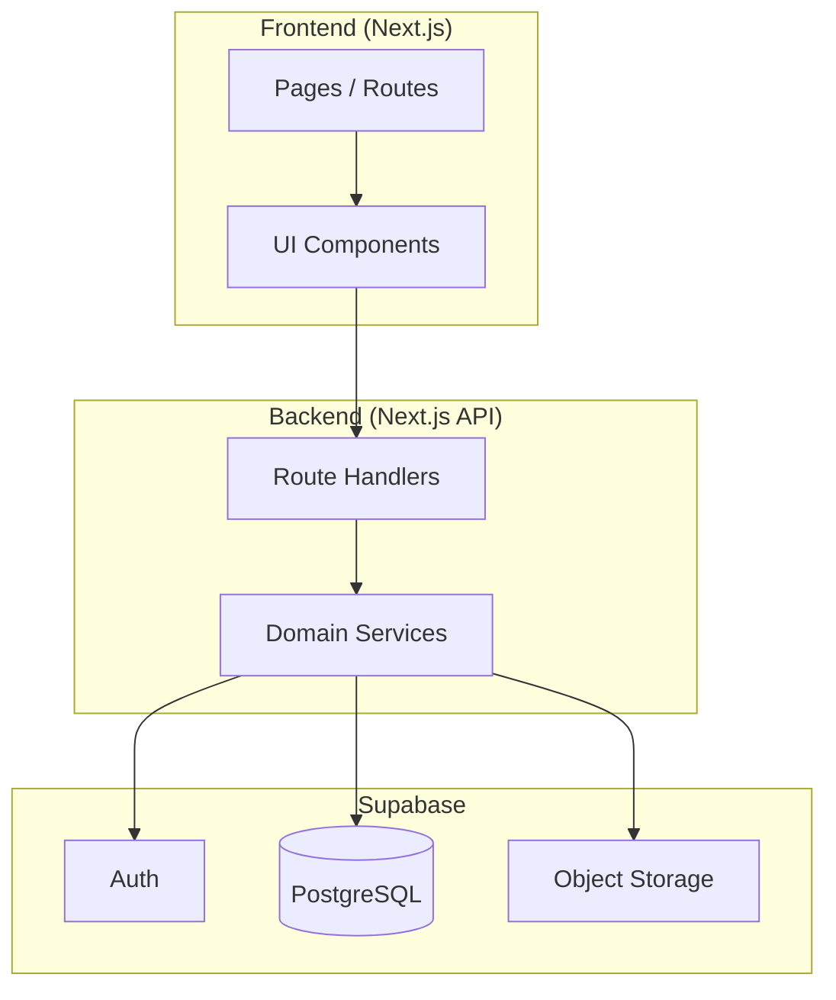
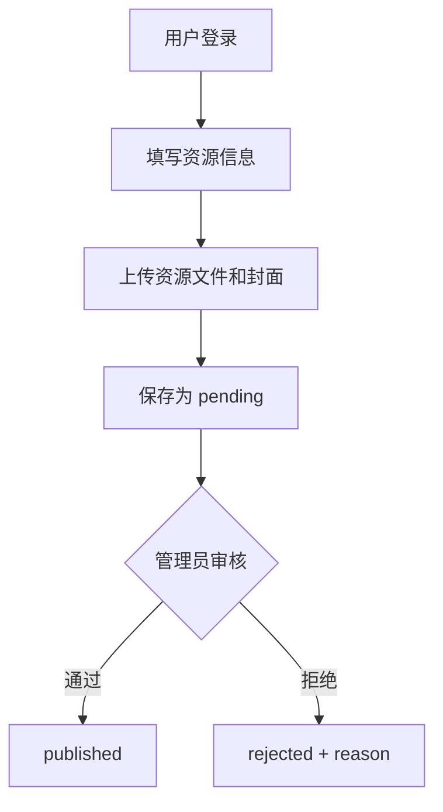
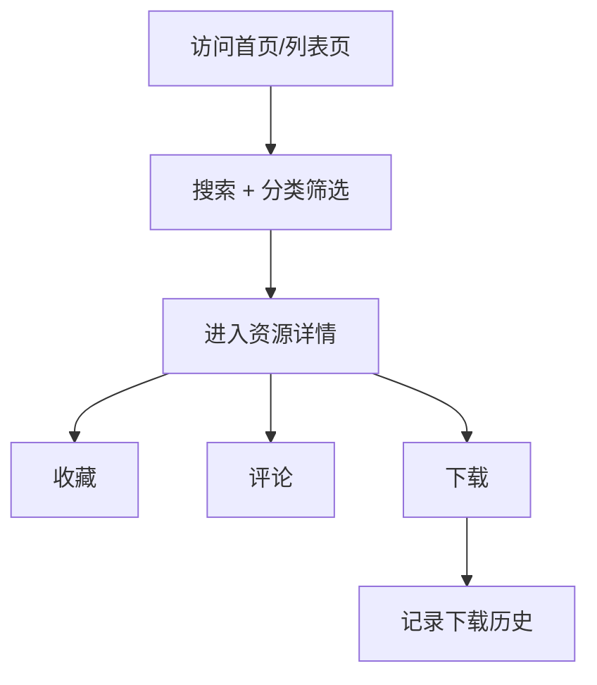
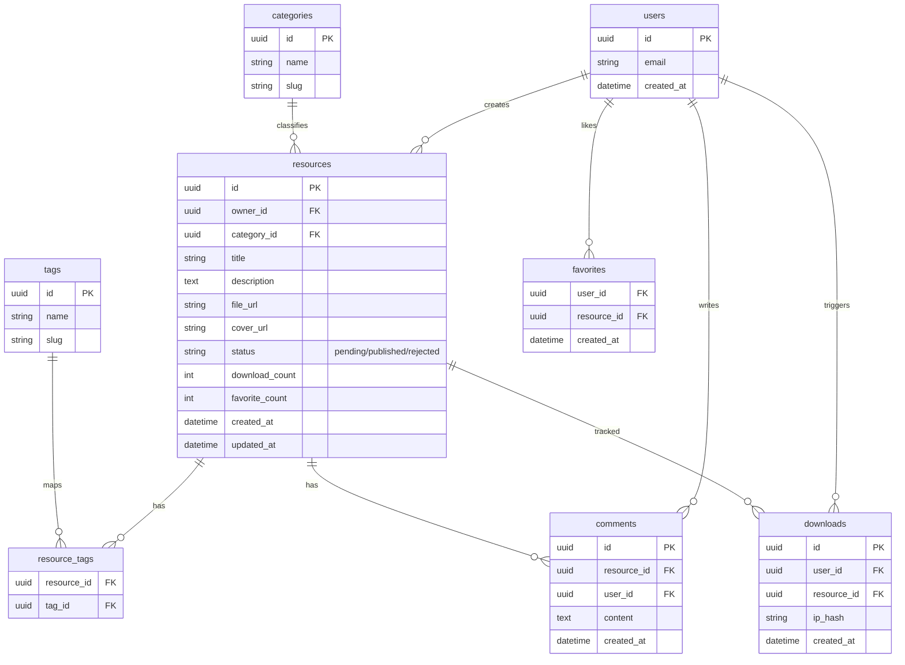
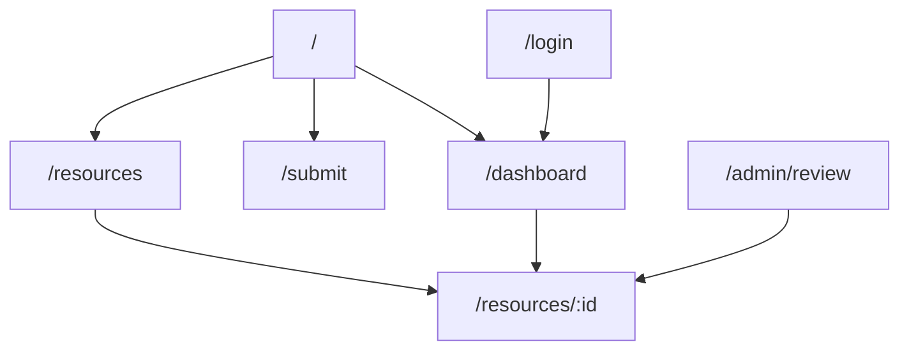

# ResourceHub - 架构设计文档

## 项目概述

`ResourceHub` 是一个资源分享网站，支持用户上传和管理资源，支持访客检索、收藏、评论和下载，支持管理员进行内容审核。

---

## 技术栈

| 层级 | 技术选型 |
| --- | --- |
| Frontend | Next.js 14+ (App Router) + TypeScript + Tailwind CSS |
| Backend | Next.js Route Handlers + Server Actions |
| Database | PostgreSQL (Supabase 托管) |
| Auth | Supabase Auth |
| Storage | Supabase Storage（资源文件 + 封面图） |
| Search | PostgreSQL Full Text + 过滤索引 |
| Deployment | Vercel + Supabase |

---

## 1. 系统架构

---

## 2. 核心业务流程

### 2.1 资源发布流程

### 2.2 资源消费流程

---

## 3. 数据模型

### 状态定义

| 字段 | 可选值 | 说明 |
| --- | --- | --- |
| `resource.status` | `pending` | 待审核 |
|  | `published` | 已上架 |
|  | `rejected` | 审核拒绝 |

---

## 4. 页面结构

页面说明：
- 首页：推荐资源、热门分类、最新上传
- 资源列表：搜索、分类过滤、标签过滤、排序、分页
- 资源详情：资源信息、评论区、收藏/下载入口
- 发布页：上传资源、填写 metadata、提交审核
- 个人中心：我的资源、我的收藏、下载记录
- 管理后台：待审核列表、通过/拒绝操作

---

## 5. API 设计（草案）

| 方法 | 路径 | 描述 |
| --- | --- | --- |
| `GET` | `/api/resources` | 资源列表（搜索/筛选/分页） |
| `POST` | `/api/resources` | 新建资源（默认 pending） |
| `GET` | `/api/resources/:id` | 获取资源详情 |
| `PATCH` | `/api/resources/:id` | 更新资源（仅 owner） |
| `DELETE` | `/api/resources/:id` | 删除资源（仅 owner/admin） |
| `POST` | `/api/resources/:id/favorite` | 收藏/取消收藏 |
| `POST` | `/api/resources/:id/download` | 下载并记录历史 |
| `POST` | `/api/resources/:id/comments` | 创建评论 |
| `GET` | `/api/resources/:id/comments` | 获取评论列表 |
| `GET` | `/api/categories` | 获取分类 |
| `GET` | `/api/tags` | 获取标签 |
| `POST` | `/api/upload` | 上传文件到 Storage |
| `POST` | `/api/admin/resources/:id/review` | 审核通过/拒绝 |

---

## 6. 非功能设计

- 性能：
  - 资源列表走分页 + 索引
  - 详情页静态化（ISR）+ 关键数据动态获取
- 安全：
  - 上传文件类型和大小校验
  - 服务端鉴权与 owner/admin 权限校验
  - 评论内容基础风控（长度、敏感词）
- 可维护性：
  - Domain service 分层
  - 统一 API error schema
  - `task.json` 驱动的渐进交付

---

## 7. 里程碑建议

1. M1：基础框架 + Auth + 数据模型
2. M2：资源 CRUD + 上传 + 列表/详情
3. M3：收藏/评论/下载 + Dashboard
4. M4：审核后台 + 稳定性与性能优化
